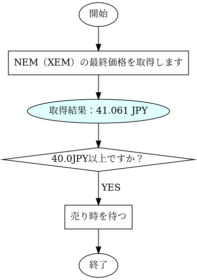
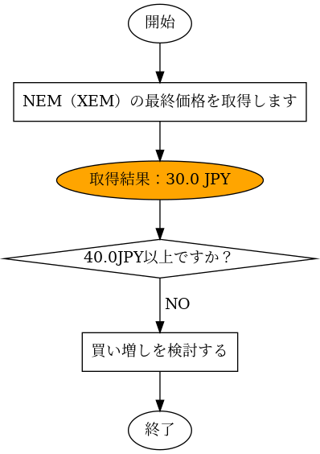

# フローチャートをプログラムで書くことのメリット（その2）


## はじめに

過去記事において、フローチャートをプログラムで書くことのメリットを語りました。
今回のこの記事では、実際にメリットの例を紹介していきたいと思います。

### フローチャートをプログラムで書くことのメリット

以前の記事で次のようなご紹介をしました

- 条件によって、チャートの出力を動的に変更できます。これはべたでチャートを書くことでは得られないメリットです。
- 大量の項目を含んだチャート図を出力する。これはチャートツールではなかなかむつかしいと思います。
- チャートの情報はテキストで書きますので、GitHubで管理できます。そのため何を変更したのか確認することも簡単です。
- ツールを使って書いた場合、位置の修正が大変です。プログラミングで行う場合は調整が楽かまたは気にしなくても良いです。
- 作図ツール・サービスはたくさんありますが、ベンダーロックオンの可能性があります。しかしそれらのツールやサービスを使用せずに、コードでチャートを書ければ、`dot`ファイルを出力するツールやライブラリに依存することがあっても、出力された`dot`ファイルもgitで管理すれば、将来においても修正を行ってメンテナンスを継続できます。

### デメリット

- ある程度のプログラミングの知識が必要。今回の場合だと`Python`言語の文法について多少知っている必要があります。
- 細かい位置調整は面倒くさい

## 条件によってチャートの出力を動的に変更

今回の例では、ZEMの最終価格をZaif取引所のAPIから取得して、その結果によって異なるフローチャートを生成します。

出力形式はPNGやJPG、SVG、PDFなどを指定できますが、今回はpngで出力します。


## 出力結果




## コードの内容

```python
import sys
from graphviz import Digraph
from zaifapi import ZaifPublicApi, ZaifFuturesPublicApi, ZaifLeverageTradeApi

FILENAME: str = "dist/flow.dot"
DEBUG: bool = True


def last_price(pair: str = "xem_jpy") -> float:
    """指定した通貨ペア（xem_jpyなど）の最終価格を取得して返します。"""
    zaif = ZaifPublicApi()
    result = zaif.last_price(pair)
    # print(type(result["last_price"]))
    if type(result["last_price"]) == float:
        return result["last_price"]
    else:
        return float(result["last_price"])


def flow(price: float, format: str = "png", comment: str = "") -> None:
    """ `price`の価格によって、異なるフローチャートを生成します。"""
    dot = Digraph(format=format, comment=comment)

    dot.node("start", "開始")
    dot.node("step1", "NEM（XEM）の最終価格を取得します", shape="box")
    if price >= 40.0:
        dot.node(
            "step2",
            str(f"取得結果：{price} JPY"),
            shape="oval",
            style="filled",
            fillcolor="lightcyan",
        )
    else:
        dot.node(
            "step2",
            str(f"取得結果：{price} JPY"),
            shape="oval",
            style="filled",
            fillcolor="orange",
        )
    dot.node("step3", "40.0JPY以上ですか？", shape="diamond")
    dot.node("end", "終了")

    dot.edge("start", "step1")
    dot.edge("step1", "step2")
    dot.edge("step2", "step3")
    if price >= 40.0:
        dot.node("step4-y", "売り時を待つ", shape="box")
        dot.edge("step3", "step4-y", label=" YES")
        dot.edge("step4-y", "end")
    else:
        dot.node("step4-n", "買い増しを検討する", shape="box")
        dot.edge("step3", "step4-n", label=" NO")
        dot.edge("step4-n", "end")

    # view=Trueの場合はOSに指定されているデフォルトの画像ビューワーが起動します。
    dot.render(FILENAME, view=False)


if __name__ == "__main__":
    try:
        price = last_price("xem_jpy")
        message = f"XEM現在価格: {price} JPY"
        if DEBUG:
            print(message)
        flow(price, format="svg")
    except:
        print(f"エラーが発生しました: {sys.exc_info()}")
```

## まとめ

いかがでしたでしょうか？
フローチャートをプログラムで書くことで、条件によって異なる内容のフローチャートを生成できる事がご理解いただけたと思います。

より複雑なフローチャートを書く時は、条件などを正しく指定すればシミレーション代わりとしても使えるのではないかと思います。


## 関連情報へのリンク

### Graphviz関連

- [Graphviz - Graph Visualization Software - Resources](https://www.graphviz.org/resources/)
- [Graphviz Online](http://dreampuf.github.io/GraphvizOnline/)

### Zaif API

- [techbureau/zaifapi: zaifのAPIを簡単にコール出来るようにしました。](https://github.com/techbureau/zaifapi)

### 作図ツール

- [draw.io](https://www.draw.io/)
- [Free Online Flowchart Maker | Figma](https://www.figma.com/templates/flowchart-maker/)
- [フローチャートやワイヤーフレーム、プレゼン資料まで作れる | Cacoo(カクー)](https://cacoo.com/ja/)

### 過去記事

- [フローチャートをプログラムで書くことのメリット（その1）](https://nemlog.nem.social/blog/55529)
- [フローチャートをプログラムで書くことのメリット（その2）](https://nemlog.nem.social/blog/55579)